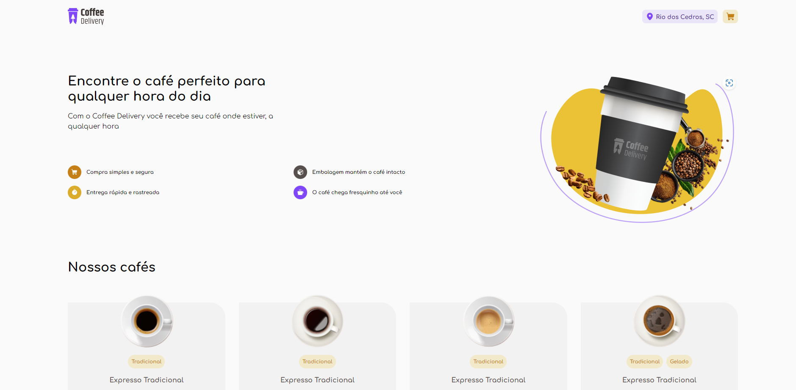
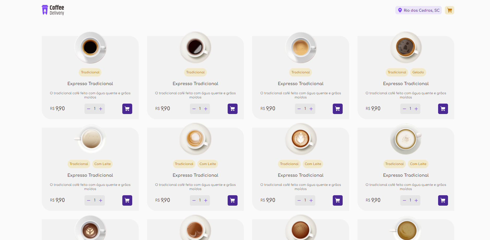
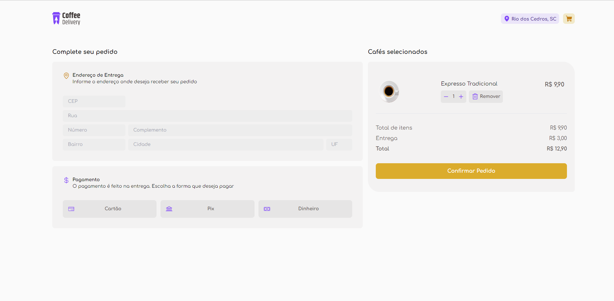
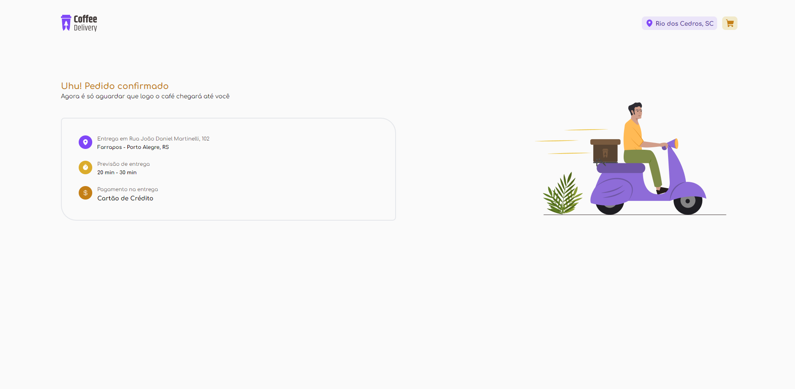

# 🚀 Coffee

Projeto criado para estudo. Objetivo criar um delivery de cafeteria .

# 🧠 Contexto

Funcionalidades:

- [ ] Adicionar no carrinho
- [ ] Remover do carrinho
- [ ] Ajustar quantidade do produto
- [ ] Localização
- [ ] Authenticação

## 📋 Tecnologias

- React.js
- Typescript
- Tailwindcss
- Node.js

## ✏️ Feito por Diogo Travalha
